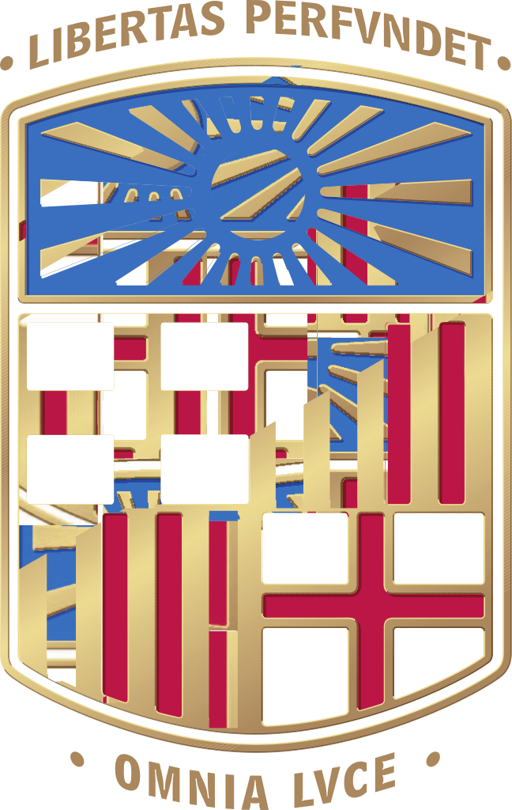

# Dynamics of Memory Formation (DMF)

<!--  -->

Welcome to the GitHub organization of the **Dynamics of Memory Formation Lab**. 

Our group is dedicated to answering a fundamental question:

> 💡 **How do we form lasting memories from our daily experiences?**

We investigate the entire process of memory formation, focusing on how memories are encoded, consolidated, and later retrieved.
By utilizing behavioral studies, psychophysiological measures, and neural imaging techniques, we aim to learn more about the cognitive and neural operations that support episodic memory. 
Our research also includes studies on neurological patients, especially those with lesions in the medial temporal lobe areas, to deepen our understanding of memory processes.

## Our Mission 🚀

**Our mission is to explore the process of Memory Formation.** We are interested in uncovering how memories are created, from the moment they are encoded in our brains, through their consolidation, to when they are retrieved. 

Our work uses a range of methods, from observing behavior and physiological responses to advanced brain imaging technologies. 
Our objective is to decode the cognitive and neural bases of episodic memory, aiming to contribute valuable insights into this complex field.

## Related links

- [More information & people](https://brainvitge.org/groups/memory_formation/)  
- [Contact us](https://brainvitge.org/contact/)

---

 

